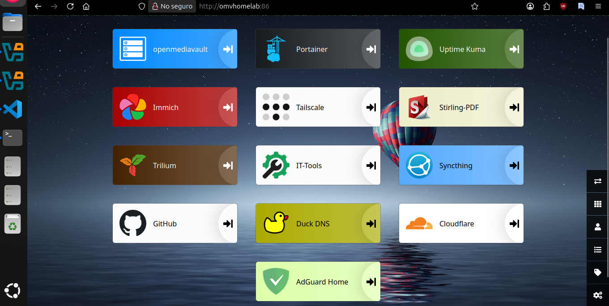
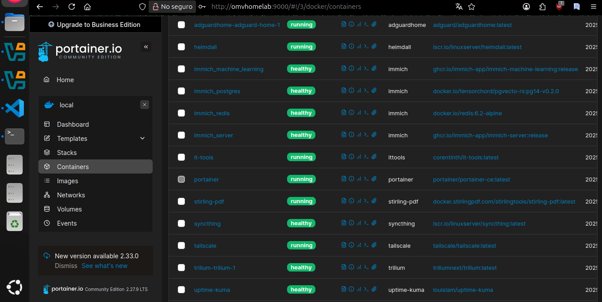

# Mi laboratorio de *Self‑Hosting*: servicios, aplicaciones y cómo los gestiono

*"De un simple servidor en casa a un laboratorio lleno de vida digital: así gestiono mi nube privada."*

En esta primera entrada quiero compartirte una mirada al corazón de mi infraestructura doméstica: un ecosistema de servicios autohospedados que me permite tener el control total de mis datos y experimentar con tecnologías que me apasionan.

## 🖥 Vista general

En la siguiente imagen puedes ver mi **homepage**, donde organizo accesos directos a cada uno de mis servicios y aplicaciones principales:

Este panel centralizado me facilita acceder de forma rápida a todas mis herramientas, tanto desde mi red local como de manera segura a través de mi VPN.

## 🐳 Gestión de contenedores con Portainer

Toda esta infraestructura está orquestada con **Docker** y administrada a través de **Portainer**:

Desde aquí monitorizo, creo y actualizo contenedores sin tener que lidiar con la línea de comandos para cada cambio.

## 📦 Servicios y aplicaciones que utilizo

- **AdGuard Home**: servidor DNS para bloquear anuncios y rastreadores, con estadísticas detalladas de peticiones.
- **Immich**: galería fotográfica autohospedada para gestionar y visualizar imágenes sin depender de la nube pública.
- **Trilium Notes**: aplicación de notas avanzada, autogestionada y privada.
- **Stirling PDF**: herramienta para trabajar con PDFs de forma local y segura.
- **Uptime Kuma**: monitorización en tiempo real del estado de mis hosts, *vhosts* y DNS.
- **Syncthing**: sincronización de carpetas entre dispositivos dentro de mi red, sin intermediarios externos.
- **IT Tools**: auténtica “navaja suiza” para utilidades de red, desarrollo y análisis.
- **Tailscale**: VPN autohospedada que me permite conectarme de forma segura sin abrir puertos.
- **OpenMediaVault**: sistema NAS para almacenamiento, copias de seguridad y compartición de archivos.

## 🔒 Filosofía y objetivos

Mi motivación principal es clara: **mantener mis datos a salvo conmigo**, explorando y probando alternativas a las soluciones comerciales.  
El *self‑hosting* no solo es un ejercicio técnico, sino también una declaración de independencia tecnológica.

---

💬 En próximas entradas compartiré guías paso a paso y configuraciones específicas de cada servicio, para que tú también puedas montar tu propio laboratorio en casa.
